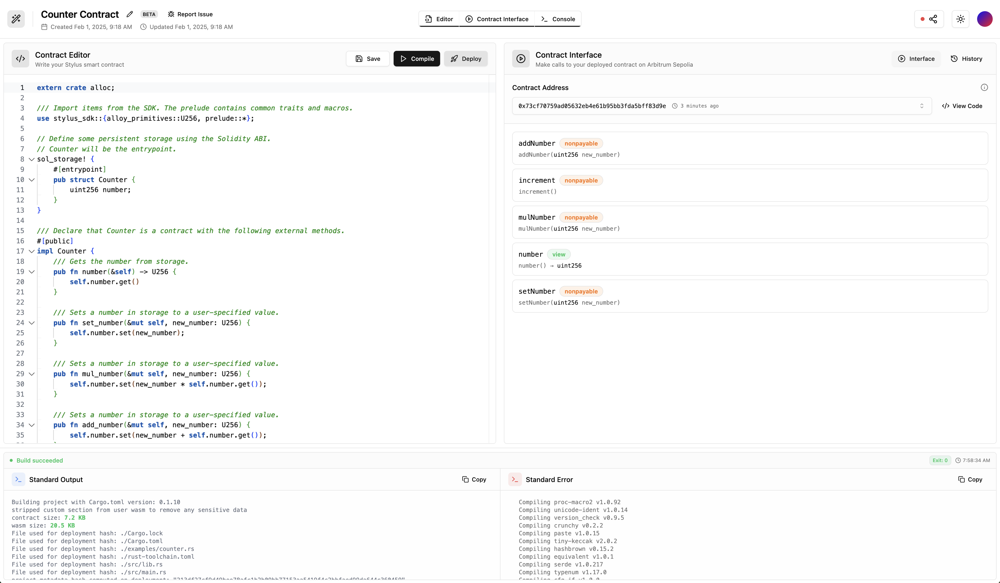

<div align="center">
  <h1>
    Wizard
  </h1>

  <p align="center">
    Write, compile, and deploy Arbitrum Stylus smart contracts directly in your browser.
  </p>

  <p align="center">
    <a href="https://thewizard.app">thewizard.app</a>
    ·
    <a href="https://docs.thewizard.app">Documentation</a>
  </p>

  <br />
  
  
</div>

## 🚀 Quick Start

### Development Setup

1. **Clone the repository**
```bash
git clone https://github.com/your-username/wizard.git
cd wizard
```

2. **Frontend Setup**
```bash
# Install dependencies
npm install

# Copy environment variables
cp .env.example .env

# Start development server
npm run dev
```

3. **Backend Setup**
```bash
cd backend

# Copy environment variables
cp .env.example .env

# Build sandbox container
./scripts/build-sandbox.sh

# Start backend server
cargo run --release
```

4. **Open your browser**
- Frontend: http://localhost:5173
- Backend API: http://localhost:8080

## ✨ Features

Wizard is a browser-based development environment that makes Arbitrum Stylus development simple and accessible.

- **Zero Setup Required** - Start building Stylus smart contracts instantly
- **Professional Editor** - Full syntax highlighting with Stylus SDK integration
- **Instant Compilation** - Compile Rust to Stylus bytecode in seconds
- **Dual Deployment Modes** - Deploy with pre-funded wallet or external wallet
- **Interactive Testing** - Test contracts through auto-generated interface
- **Code Sharing** - Share contracts via public links
- **External Wallet Support** - Connect MetaMask, WalletConnect, and more
- **Multi-Network Support** - Deploy to Arbitrum Sepolia and Arbitrum One

## 🏗️ Architecture

### Frontend (React + TypeScript)
- **Framework**: React 18 with TypeScript
- **Build Tool**: Vite
- **Styling**: Tailwind CSS + shadcn/ui components
- **Editor**: Monaco Editor with Rust/Stylus language support
- **Wallet Integration**: Wagmi v2 + RainbowKit
- **State Management**: React hooks with context

### Backend (Rust + Docker)
- **Framework**: Actix Web
- **Database**: Supabase (PostgreSQL)
- **Compilation**: Docker-based sandboxed environment
- **WebSockets**: Real-time terminal and events
- **Authentication**: Supabase Auth + GitHub OAuth

## 💫 Wizard vs Traditional Setup

| Feature | Traditional Setup | Wizard |
|---------|-------------|---------|
| Initial Setup | 30+ minutes of installation & configuration | < 30 seconds - just open browser |
| Prerequisites | Rust toolchain, Docker, VS Code, Foundry | Modern web browser only |
| Development | Local machine setup with multiple tools | Fully browser-based IDE |
| Compilation | Local WASM toolchain configuration | Instant cloud compilation |
| Deployment | Manual wallet & network configuration | One-click deployment + external wallet support |
| Testing | Local test environment setup | Instant ABI generation & testing interface |
| Updates | Manual toolchain updates | Always up-to-date platform |
| Collaboration | Complex environment sharing | Instant contract sharing |

## 📁 Project Structure

```
wizard/
├── src/                    # Frontend source code
│   ├── components/         # React components
│   ├── lib/               # Utilities and services
│   ├── pages/             # Route components
│   └── types/             # TypeScript types
├── backend/               # Backend source code
│   ├── src/              # Rust source code
│   ├── docker/           # Docker configurations
│   └── scripts/          # Build scripts
├── docs/                 # Documentation
└── supabase/             # Database migrations
```

## 🛠️ Development Commands

### Frontend
```bash
npm run dev          # Start development server
npm run build        # Build for production
npm run lint         # Run linter
npm run preview      # Preview production build
npm run docs:dev     # Start documentation server
```

### Backend
```bash
cargo run            # Start development server
cargo build --release # Build for production
cargo test           # Run tests
./scripts/build-sandbox.sh # Build sandbox container
```

## 🔧 Environment Variables

### Frontend (.env)
```bash
VITE_BACKEND_URL=http://localhost:8080
VITE_SUPABASE_URL=your-supabase-url
VITE_SUPABASE_ANON_KEY=your-supabase-anon-key
VITE_GA_TRACKING_ID=your-ga-tracking-id
```

### Backend (.env)
```bash
DATABASE_URL=postgresql://...
SUPABASE_URL=your-supabase-url
SUPABASE_ANON_KEY=your-supabase-anon-key
CONTRACT_PRIVATE_KEY=your-contract-private-key
GITHUB_CLIENT_ID=your-github-oauth-id
GITHUB_CLIENT_SECRET=your-github-oauth-secret
```

See `.env.example` files in both directories for complete lists.

## 🤝 Contributing

Contributions are welcome! Please read our [Contributing Guide](CONTRIBUTING.md) for details on our code of conduct and the process for submitting pull requests.

### Development Workflow
1. Fork the repository
2. Create a feature branch
3. Make your changes
4. Test thoroughly
5. Submit a pull request

## 📝 License

This project is licensed under the MIT License - see the [LICENSE](LICENSE) file for details.